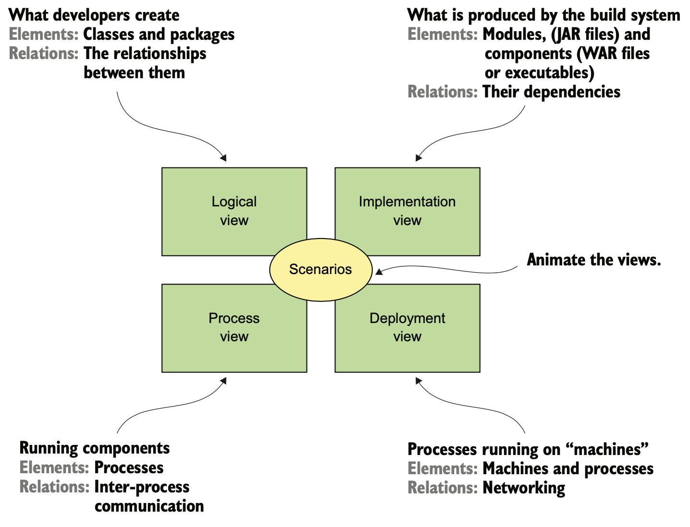

# Decomposition Strategies

Sources: Microservices Patterns (Chapter 2)

## What is the microservice architecture exactly?
On one hand, describing the microservice architecture as a kind of functional decomposition is useful. But on the other hand, it leaves several questions unanswered, including: 
* How does the microservice architecture relate to the broader concepts of software architecture
* What’s a service? 
* And how important is the size of a service?

Architecture is clearly important. There are at least two conferences dedicated to the topic: [O’Reilly Software Architecture Conference](https://conferences.oreilly.com/software-architecture) and the [SATURN conference](https://resources.sei.cmu.edu/news-events/events/saturn/). 

There are numerous definitions of [software architecture](https://en.wikiquote.org/wiki/Software_architecture). My favorite definition comes from Len Bass and colleagues at the Software Engineering Institute (www.sei.cmu.edu): *The software architecture of a computing system is the set of structures needed to reason about the system, which comprise software elements, relations among them, and properties of both. - Documenting Software Architectures by Bass et al.*

An application’s architecture is its decomposition into parts (the elements) and the relationships (the relations) between those parts. Decomposition is important for a couple of reasons:
* It facilitates the division of labor and knowledge. It enables multiple people (or multiple teams) with possibly specialized knowledge to work productively together on an application.
* It defines how the software elements interact.

## The 4+1 view model of software architecture

An application’s architecture can be viewed from multiple perspectives, in the same way that a building’s architecture can be viewed from structural, plumbing, electrical, and other perspectives. Phillip Krutchen wrote a classic paper [Architectural Blueprints — The ‘4+1’ View Model of Software Architecture](www.cs.ubc.ca/~gregor/teaching/papers/4+1view-architecture.pdf). The 4+1 model, defines four different views of a software architecture. Each describes a particular aspect of the architecture and consists of a particular set of software elements and relationships between them.

The 4+1 view model is an excellent way to describe an applications’s architecture. Each view describes an important aspect of the architecture, and the scenarios illustrate how the elements of a view collaborate.

## Architectural styles
In the physical world, a building’s architecture often follows a particular style, such as Victorian, American Craftsman, or Art Deco. Each style is a package of design decisions that constrains a building’s features and building materials. 

[David Garlan and Mary Shaw - An Introduction to Software Architecture, January 1994](https://www.cs.cmu.edu/afs/cs/project/able/ftp/intro_softarch/intro_softarch.pdf), pioneers in the discipline of software architecture, and defines an architectural style as follows: 

*An architectural style, then, defines a family of such systems in terms of a pattern of structural organization. More specifically, an architectural style determines the vocabulary of components and connectors that can be used in instances of that style, together with a set of constraints on how they can be combined.*

## Layered

## Exagonal

## SOA

## Microservices