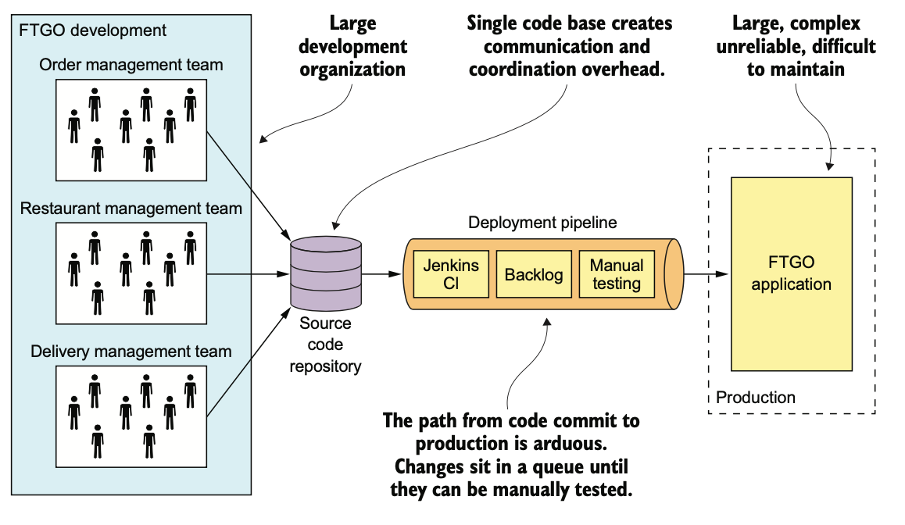
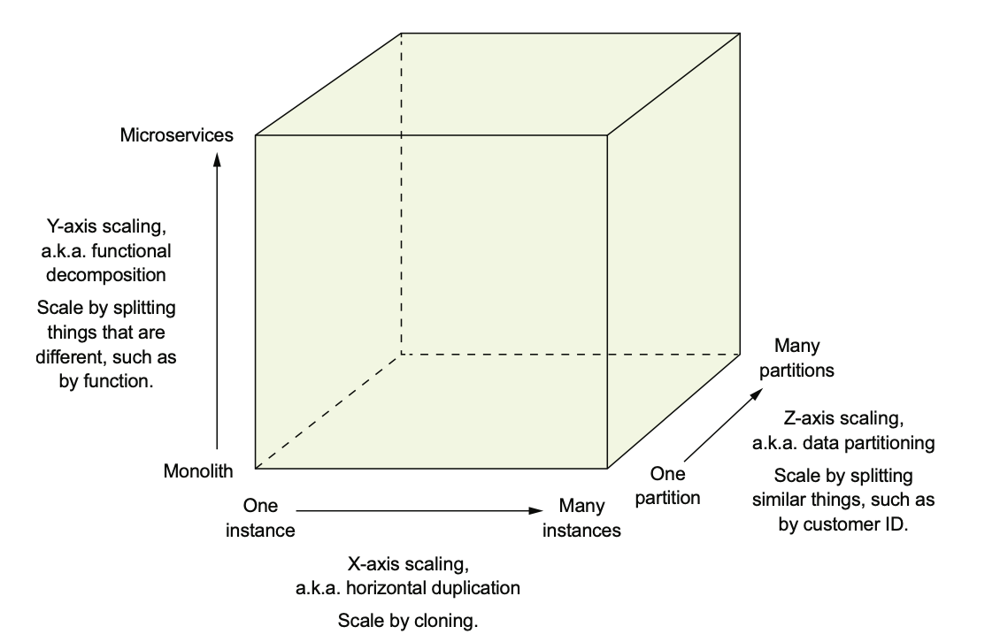
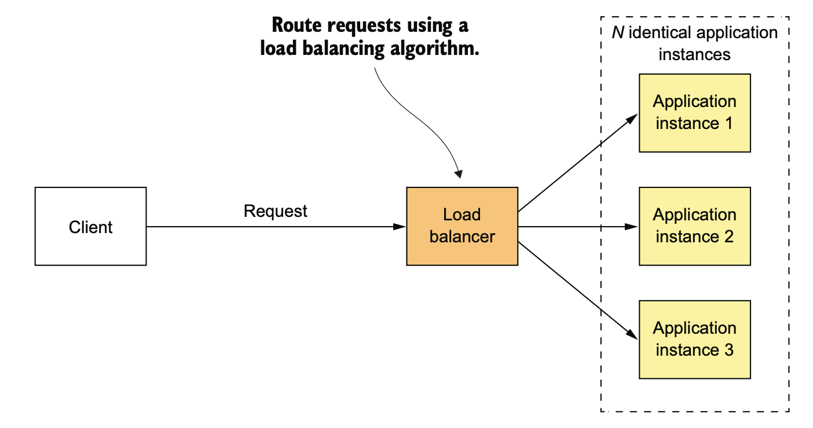
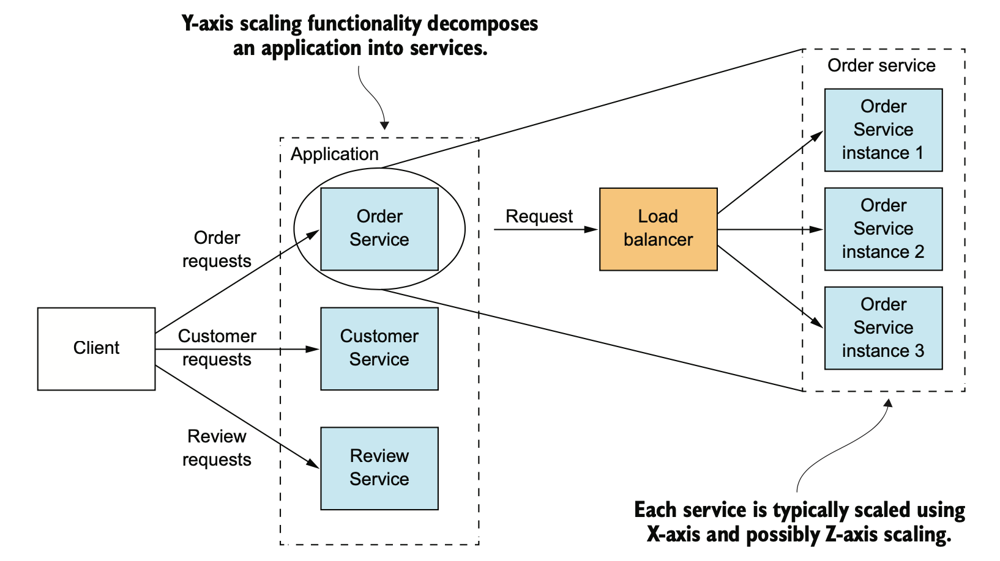
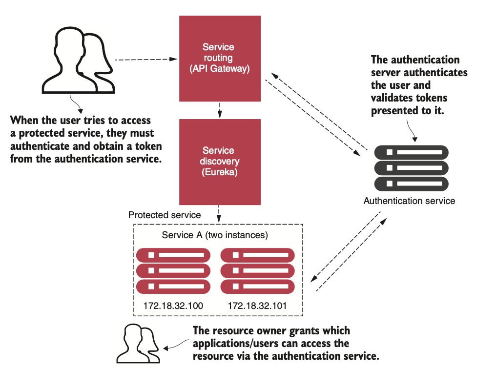
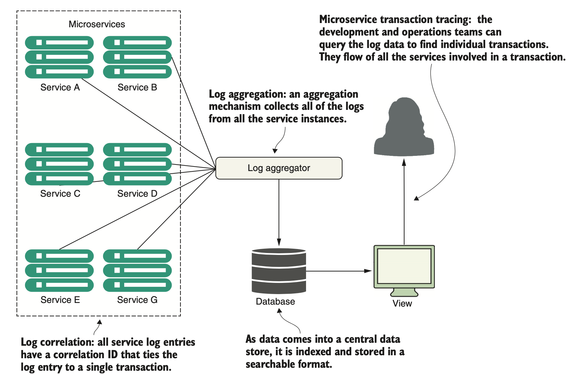

# Introduction to microservices

Sources: Microservices Patterns (Chapter 1)

## The benefits of the monolithic architecture
When applications are relatively small, the monolithic architecture has lots of benefits:
* **Simple to develop**: IDEs and other developer tools are focused on building a single application.
* **Easy to make radical changes to the application**: You can change the code and the database schema, build, and deploy.
* **Straightforward to test**: The developers wrote end-to-end tests that launched the application, invoked the REST API, and tested the UI with Selenium.
* **Straightforward to deploy**: All a developer had to do was copy the WAR file to a server that had Tomcat installed.
* **Easy to scale**: FTGO ran multiple instances of the application behind a load balancer.

## Living in monolithic hell

Successful applications like the FTGO application have a habit of outgrowing the monolithic architecture. Development is slow and painful. Agile development and deployment is impossible.

* **Development is slow**: Building the application takes a long time. Moreover, the application takes a long time to start up. As a result, the edit-build-run-test loop takes a long time, which badly impacts productivity.
* **Path from commit to deployment is long and arduous**: Updating production more than once a month seems like a distant dream. And adopting continuous deployment seems next to impossible (Amazon deploys every few seconds...).
* **Scaling is difficult**: Different application modules have conflicting resource requirements. However, because these modules are part of the same application, the company must compromise on the server configuration.
* **Delivering a reliable monolith is challenging**: Testing the application thoroughly is difficult, due to its large size. This lack of testability means bugs make their way into production.
* **Locked into increasingly obsolete technology stack**: The monolithic architecture makes it difficult to adopt new frameworks and languages. It would be extremely expensive and risky to rewrite the entire monolithic application so that it would use a new technology. 

## Microservice architecture to the rescue

Software architecture has very little to do with functional requirements. You can implement a set of use cases with any architecture.

Architecture matters, however, because of how it affects the so-called quality of service requirements, also called **nonfunctional requirements**, or **quality attributes** 

On the one hand, a disciplined team can slow down the pace of its descent toward monolithic hell. On the other hand, they can’t avoid the issues of a large team working on a single monolithic application. 

Today, the growing consensus is that if you’re building a large, complex application, you should consider using the microservice architecture. Adrian Cockcroft, formerly of Netflix, defines a **microservice architecture as a service-oriented architecture composed of loosely coupled elements that have bounded contexts**.

## Scale cube and microservices

X-axis scaling is a common way to scale a monolithic application. You run multiple instances of the application behind a load balancer. 

Z-axis scaling also runs multiple instances of the monolith application, but unlike X-axis scaling, each instance is responsible for only a subset of the data. An application might, for example, route requests using userId.

X- and Z-axis scaling improve the application’s capacity and availability. But neither approach solves the problem of increasing development and application complexity. To solve those, you need to apply Y-axis scaling, or functional decomposition. A service is a mini application that implements narrowly focused functionality. 

## Microservices as a form of modularity

Modularity is essential when developing large, complex applications. A modern application is too large to be developed by an individual. **Long- lived, monolithic applications usually degenerate into big balls of mud.**

The microservice architecture uses services as the unit of modularity. A service has an API, which is an impermeable boundary that is difficult to violate. **You can’t bypass the API and access an internal class as you can with a Java package**. As a result, it’s much easier to preserve the modularity of the application over time. 

A key characteristic of the microservice architecture is that the services are loosely coupled and communicate only via APIs. **One way to achieve loose coupling is by each service having its own datastore**.

## Benefits and drawbacks of the microservice architecture
The microservice architecture has the following benefits:
* It enables the continuous delivery and deployment of large, complex applications.
* Services are small and easily maintained.
* Services are independently deployable.
* Services are independently scalable.
* The microservice architecture enables teams to be autonomous.
* It allows easy experimenting and adoption of new technologies.
* It has better fault isolation.

The microservice architecture has the following drawbacks:
* Finding the right set of services is challenging.
* Distributed systems are complex, which makes development, testing, and deployment difficult.
* Deploying features that span multiple services requires careful coordination.
* Deciding when to adopt the microservice architecture is difficult.

## Beyond microservices: Process and organization

For a large, complex application, the microservice architecture is usually the best choice. But in addition to having the right architecture, successful software development requires you to also have organization, and development and delivery processes.

**Team size:** The trouble with large teams is, as Fred Brooks wrote in The Mythical Man-Month, the communication overhead of a team of size N is O(N 2). The solution is to refactor a large single team into a team of teams. Each team is small (10 people), it has a clearly defined business-oriented mission, it is cross-functional and can develop, test, and deploy its services without having to frequently communicate or coordinate with other teams.

**Delivery process:** Using the microservice architecture with a waterfall development process is like driving a horse-drawn Ferrari. If you want to develop an application with the microservice architecture, it’s essential that you adopt agile development and deployment practices such as Scrum or Kanban. Better yet, you should practice continuous delivery/deployment, which is a part of DevOps.

The goal of continuous delivery/deployment (and, more generally, DevOps) is to rapidly yet reliably deliver software. Four useful metrics for assessing software development are as follows:
* Deployment frequency: How often software is deployed into production
* Lead time: Time from a developer checking in a change to that change being deployed
* Mean time to recover: Time to recover from a production problem
* Change failure rate: Percentage of changes that result in a production problem

**Organization structure**: In order to effectively deliver software when using the microservice architecture, you need to take into account [Conway’s law](https://en.wikipedia.org/wiki/Conway%27s_law), which states the following:

*Organizations which design systems [...] are constrained to produce designs which are copies of the communication structures of these organizations. - Melvin Conway*

In other words, your application’s architecture mirrors the structure of the organization that developed it. It’s important, therefore, to apply Conway’s law [in reverse](www.thoughtworks.com/radar/techniques/inverse-conway-maneuver) and design your organization so that its structure mirrors your microservice architecture. By doing so, you ensure that your development teams are as loosely coupled as the services.

## Microservices and Cloud computing

The cloud computing models let the user choose the level of control over the information and services that these provide. These models are known by their acronyms, and are generically referred to as XaaS—an acronym that means anything as a service.

* **Infrastructure as a Service (IaaS):** The vendor provides the infrastructure that lets you access computing resources such as servers, storage, and networks. In this model, the user is responsible for everything related to the maintenance of the infrastructure and the scalability of the application.
* **Container as a Service (CaaS):** An intermediate model between the IaaS and the PaaS, it refers to a form of container-based virtualization. Unlike an IaaS model, where a developer manages the virtual machine to which the service is deployed, with CaaS, you deploy your microservices in a lightweight, portable virtual container (such as Docker) to a cloud provider. 
* **Platform as a Service (PaaS):** This model provides a platform and an environment that allow users to focus on the development, execution, and maintenance of the application. The applications can be created with tools that are provided by the vendor (for example, operating system, database management systems, technical support, storage, hosting, network, and more). Users do not need to invest in a physical infrastructure, nor spend time managing it, allowing them to concentrate exclusively on the development of applications.
* **Function as a Service (FaaS):** Also known as serverless architecture, despite the name, this architecture doesn’t mean running specific code without a server. What it means is a way of executing functionalities in the cloud in which the vendor provides all the required servers. Serverless architecture allows us to focus only on the development of services without having to worry about scaling, provisioning, and server administration.
* **Software as a Service (SaaS):** Also known as software on demand, this model allows users to use a specific application without having to deploy or to maintain it. In most cases, the access is through a web browser. Everything is managed by the ser- vice provider: application, data, operating system, virtualization, servers, storage, and network. The user just hires the service and uses the software.

For this course, all the microservices and corresponding service infrastructure will be deployed to a CaaS-based cloud provider using Docker containers.
* **Simplified infrastructure management:** CaaS cloud providers give you the ability to have more control over your services. New services can be started and stopped with simple API calls.
* **Massive horizontal scalability:** CaaS cloud providers allow you to quickly and succinctly start one or more instances of a service. This capability means you can quickly scale services and route around misbehaving or failing servers.
* **High redundancy through geographic distribution:** By necessity, CaaS providers have multiple data centers. By deploying your microservices using a CaaS cloud provider, you can gain a higher level of redundancy beyond using clusters in a data center.

## Microservices are more than writing the code

## Core microservice development pattern

## Microservice routing patterns

## Microservice client resiliency

## Microservice security patterns

## Microservice logging and tracing patterns

## Application metrics pattern

## Microservice build/deployment patterns
